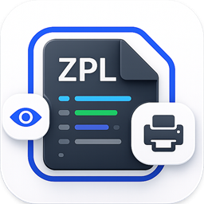
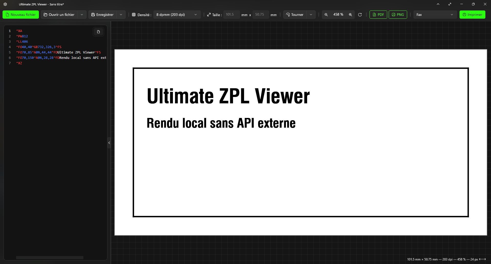
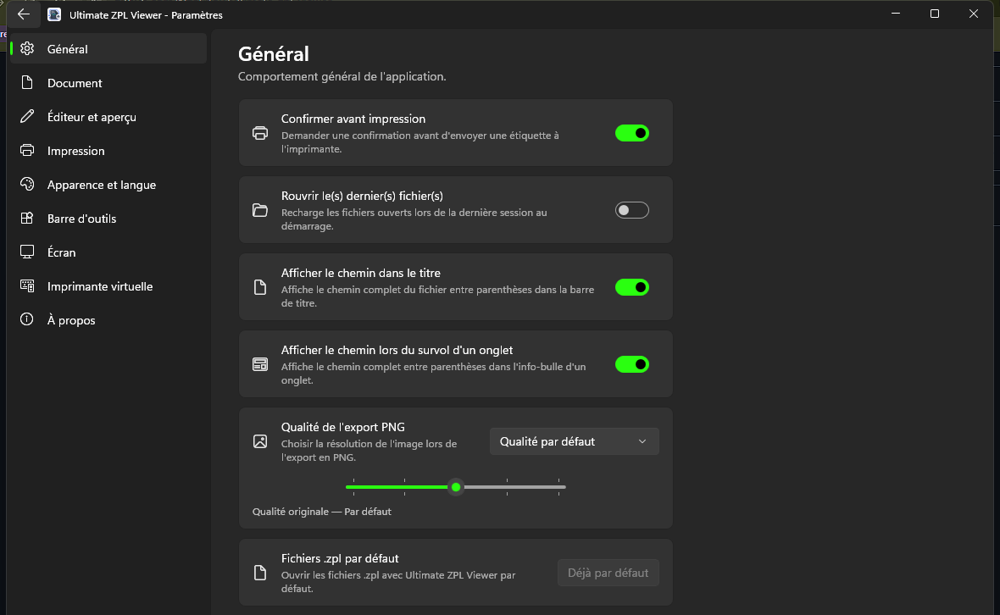

<div align="center">



# Ultimate ZPL Viewer

**Visualisez, éditez et imprimez vos étiquettes ZPL — 100 % en local, sans aucune API externe.** 🏷️

[](#-installation)
[](#-technologies)
[](#-technologies)
[](LICENSE)



</div>

---

## ✨ Fonctionnalités

- 🖥️ **Rendu 100 % local** — vos étiquettes ne quittent jamais votre machine, aucune connexion internet requise.
- ✍️ **Éditeur intégré** (Monaco) avec coloration syntaxique du ZPL, numéros de ligne, minimap et analyse en direct des erreurs.
- 👁️ **Aperçu temps réel** fidèle, à la **taille réelle**, avec zoom (mémorisé par onglet), grille et règles configurables.
- 🗂️ **Onglets multiples** pour travailler sur plusieurs étiquettes à la fois.
- 📄 **Export PDF vectoriel** (net à n'importe quel zoom) et **PNG** avec choix de la **qualité / résolution**.
- 🖨️ **Impression directe** vers une imprimante **Zebra** (ou compatible ZPL) en données brutes.
- 🪄 **Imprimante virtuelle** « Ultimate ZPL Viewer » : imprimez un fichier ZPL depuis n'importe quel logiciel, l'aperçu s'ouvre automatiquement.
- 🌗 **Thèmes** clair / sombre (+ mode « sombre & aperçu clair ») et **couleurs personnalisables**.
- 🌍 **Multilingue** (Français / English), langues **personnalisables et extensibles**.
- 🔗 **Association `.zpl`** : double-cliquez un fichier `.zpl` pour l'ouvrir directement.

## 🧱 Prise en charge du ZPL

Un moteur de rendu **maison**, calibré au pixel sur des étiquettes réelles.

- **Texte & polices** : `^A` / `^A0` (orientations 0/90/180/270°, condensé), polices bitmap A–H, `^CF`, `^FB` (blocs justifiés), `^FH`.
- **Graphiques** : `^GB` (cadres / lignes / barres), `^GC`/`^GE` (cercles/ellipses), `^GD`, `^GF` / `^GFA` — hexadécimal, compression **ACS**, et **`:Z64:` / `:B64:`** (base64 + zlib).
- **Codes-barres 1D** : **Code 128** (`^BC`, sous-ensembles A/B/C), Code 39 (`^B3`), Interleaved 2 of 5 (`^B2`), EAN‑13/8 & UPC‑A.
- **Codes-barres 2D** : **QR** (`^BQ`), **DataMatrix** (`^BX`), **Aztec** (`^BO`), **PDF417** (`^B7`) — tous générés et **scannables**.
- **Mise en page** : `^PW`/`^LL`, `^LH`, `^FO`/`^FT`, `^LT`, `^LS`, `^POI`, `^FR` (inversion), formats stockés `^DF`/`^XF`/`^FN`.

## 📸 Captures d'écran

|  Éditeur & aperçu  |  Paramètres  |
| :---: | :---: |
|  |  |

## 🚀 Installation

1. Rendez‑vous dans la section **[Releases](../../releases)** et téléchargez le dernier `UltimateZplViewer-Setup-x.y.z.exe`.
2. Lancez l'installateur.
   > ⚠️ L'application n'étant pas signée, Windows peut afficher **« Windows a protégé votre ordinateur »** → cliquez **« Informations complémentaires »** puis **« Exécuter quand même »**.
3. L'installation se fait **par utilisateur**, **sans droits administrateur**. Rien d'autre à installer (runtime .NET & WinUI inclus).

## 🪄 Imprimante virtuelle

Depuis les **Paramètres → Imprimante virtuelle**, installez l'imprimante « Ultimate ZPL Viewer » (une autorisation administrateur est demandée une seule fois). Ensuite, **imprimez un fichier `.zpl` depuis n'importe quel logiciel** en choisissant cette imprimante : l'application s'ouvre automatiquement et affiche l'aperçu, prêt à être imprimé sur une vraie Zebra.

## 🛠️ Compiler depuis les sources

**Prérequis** : Windows 10/11, [.NET 8 SDK](https://dotnet.microsoft.com/download/dotnet/8.0) + charge de travail « Développement Windows App SDK » (Visual Studio 2022+).

```bash
# Compiler & lancer
dotnet run --project "Ultimate ZPL Viewer/Ultimate ZPL Viewer.csproj" -p:Platform=x64
```

Créer l'installateur redistribuable (application autonome + `Setup.exe`) en une commande — nécessite [Inno Setup 6](https://jrsoftware.org/isinfo.php) :

```bash
powershell -ExecutionPolicy Bypass -File "Ultimate ZPL Viewer/installer/build-installer.ps1"
```

Le `Setup.exe` est généré dans `Ultimate ZPL Viewer/installer/Output/`.

## 🧩 Technologies

- **WinUI 3** (Windows App SDK) · **.NET 8** · C#
- **Monaco Editor** hébergé dans **WebView2**
- **Win2D** pour le rendu de l'aperçu, moteur PDF vectoriel maison
- **[PDFtoImage](https://github.com/sungaila/PDFtoImage)** pour la rastérisation
- **[Inno Setup](https://jrsoftware.org/isinfo.php)** pour l'installateur

## 📝 Changelog

Voir **[CHANGELOG.md](CHANGELOG.md)** pour l'historique des versions.

## 📄 Licence

Distribué sous licence **MIT** — voir [LICENSE](LICENSE).

## 👤 Auteur

**Enzo Monchanin** *(NzoSifou)* — [@NzoSifou](https://github.com/NzoSifou)

<div align="center">
<sub>Fait avec ❤️ pour simplifier le travail avec les étiquettes ZPL.</sub>
</div>
